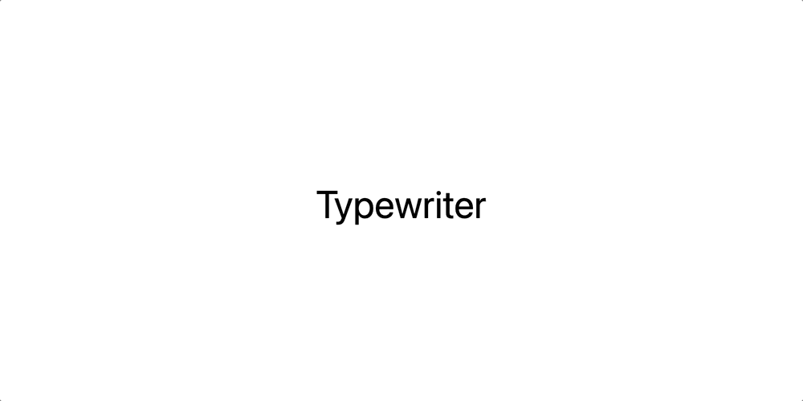

<h1 align="center">⌨️ Alpine Typewriter ⌨️</h1>

<p align="center">
  An <a href="https://alpinejs.dev">Alpine.js</a> plugin to add a typewriter effect to any HTML element.
</p>

<p align="center">
  <a href="https://www.npmjs.com/package/@marcreichel/alpine-typewriter">
    
  </a>
  <a href="https://www.npmjs.com/package/@marcreichel/alpine-typewriter">
    
  </a>
  <a href="https://www.npmjs.com/package/@marcreichel/alpine-typewriter">
    
  </a>
  <a href="https://www.jsdelivr.com/package/npm/@marcreichel/alpine-typewriter">
    
  </a>
  <a href="https://www.npmjs.com/package/@marcreichel/alpine-typewriter">
    
  </a>
  <a href="https://gitmoji.dev/">
    
  </a>
</p>



## 🚀 Installation

### CDN

Include the following `<script>` tag in the `<head>` of your document, just before Alpine.

```html
<script
    src="https://cdn.jsdelivr.net/npm/@marcreichel/alpine-typewriter@latest/dist/alpine-typewriter.min.js"
    defer
></script>
```

### NPM

```shell
npm install @marcreichel/alpine-typewriter
```

Add the `x-typewriter` directive to your project by importing the package **before** starting Alpine.

```js
import Alpine from 'alpinejs';
import Typewriter from '@marcreichel/alpine-typewriter';

Alpine.plugin(Typewriter);

Alpine.start();
```

## 🪄 Usage

Simply add the `x-typewriter` directive to any HTML element and provide the texts which should be cycled through.

```html
<span x-data="{ texts: ['Hello', 'World'] }" x-typewriter="texts"></span>
```

### Adjust the speed

By default, a text stays for 2 seconds before being swapped out. This behavior may be adjusted using a modifier like so:

```html
<span x-data="{ texts: ['Hello', 'World'] }" x-typewriter.5s="texts"></span>
```

or

```html
<span x-data="{ texts: ['Hello', 'World'] }" x-typewriter.3000ms="texts"></span>
```

## 📄 License

Copyright (c) 2022 Marc Reichel and contributors.

Licensed under the MIT license, see [LICENSE](LICENSE) for details.
